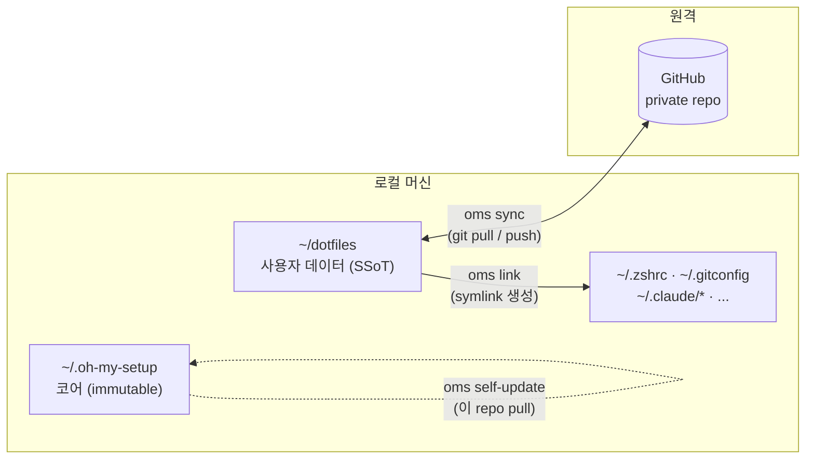
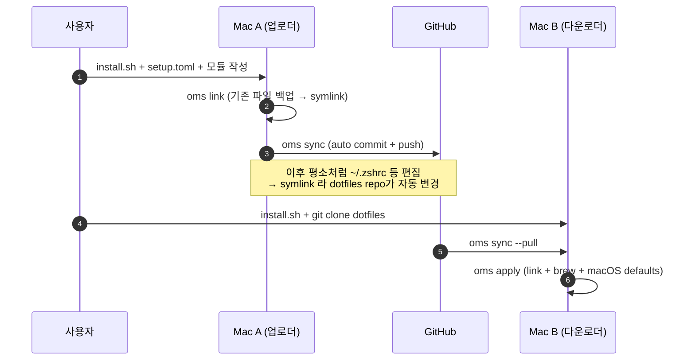

# oh-my-setup (oms)

> macOS 개발 환경을 **선언적 + Git 기반**으로 여러 기기에 동기화하는 Shell CLI.
> Homebrew 패키지, dotfile, Claude Code 설정, Karabiner/Raycast 등 머신을 옮길 때마다 다시 설정하던 것들을 한 번 정의해두면 새 기기에서도 명령 한 줄로 복원된다.

---

## 0. 한눈에 보는 그림

```
┌──────────────────────────────────────────────────────────────────────┐
│  oms 는 두 개의 분리된 git 저장소로 동작한다.                          │
│                                                                       │
│   ① 프레임워크 (이 repo)            ② 사용자 dotfiles (개인 repo)     │
│   ~/.oh-my-setup/                  ~/dotfiles/                        │
│   - bin/oms (CLI)                  - setup.toml                       │
│   - lib/*.sh (코어 로직)            - Brewfile                         │
│   - modules/ (내장 모듈)            - modules/<my>/ (개인 모듈)        │
│                                    - machines/<host>.toml (선택)      │
│                                                                       │
│   ↑ self-update (oms self-update)  ↑↓ oms sync = git pull/push        │
└──────────────────────────────────────────────────────────────────────┘

  Mac A ──[ oms snapshot → oms sync ]──▶ GitHub ◀──[ oms sync → oms apply ]── Mac B
        새 설정 캡처 후 push                              pull 후 적용
```

같은 그림을 GitHub 에서 렌더링되게 한 번 더 (Mermaid):



핵심: **`~/.oh-my-setup`은 손대지 않는 코어**, **`~/dotfiles`는 사용자가 채워가는 개인 데이터**. 동기화의 SSoT(single source of truth)는 `~/dotfiles`의 git remote.

---

## 0.1 전체 플로우 (한 사이클)

처음 셋업부터 두 번째 머신까지의 흐름:



---

## 1. 사전 요구사항

- macOS Ventura (13.0+)
- Git — **multi-machine 동기화 (`oms sync`) 에 사용.** single-machine 로컬 백업/링크 용도로만 쓸 거면 git 없어도 동작 (자세한 건 §2.0).
- (선택) Homebrew — `apply`/`brew` 명령에서 사용

---

## 2. 첫 기기 셋업 (= 업로더)

### 2.0 먼저 사용 모드를 고른다

| 모드 | 누구를 위한 것 | 진행할 절 |
|---|---|---|
| **A. Single-machine** | 한 머신에서 dotfile/모듈을 정리·백업만 하고 싶다. git 안 씀. | §2.1 + §2.3 (단 `[git]` 섹션은 비워둠) + §2.4 + `oms link`. **`oms sync` 호출하지 않는다.** |
| **B. Multi-machine** | 여러 기기에 동일 환경을 동기화. git 사용. (가장 일반적) | §2.1 ~ §2.5 전체 |

이후 모든 단계는 두 모드 공통으로 적용되며, B 에서만 추가로 필요한 것은 그때그때 표시한다.

### 2.1 프레임워크 설치

```bash
git clone https://github.com/dorrot101/oh-my-setup.git ~/.oh-my-setup
bash ~/.oh-my-setup/scripts/install.sh
```

> `~/.oh-my-setup` 이외의 위치에 두려면 `OMS_HOME` 환경변수를 export. 예:
> `export OMS_HOME="$HOME/Documents/codespace/private/util/oh-my-setup"`

### 2.2 PATH 등록 + 환경변수

`install.sh` 가 일부를 자동으로 처리한다. 아래 표에서 ❌ 인 항목만 수동.

| 항목 | install.sh 자동 처리 | 수동 필요 |
|---|---|---|
| `oms` 바이너리 PATH | ✅ `/opt/homebrew/bin/oms` 또는 `/usr/local/bin/oms` 로 심볼릭링크 시도 → 실패 시 `~/.zshrc` 에 PATH append | — |
| update-check 훅 | ✅ `~/.zshrc` 끝에 `source $OMS_HOME/lib/update.sh` 한 줄 추가 | — |
| `OMS_HOME` env | ❌ | ✅ 기본 위치(`~/.oh-my-setup`) 쓰면 생략 가능 |
| `OMS_DOTFILES` env | ❌ | ✅ **항상 필요** |

따라서 `~/.zshrc` 또는 `~/.zprofile` 끝에 다음을 추가:

```bash
export OMS_HOME="$HOME/.oh-my-setup"          # 위치를 바꿨다면 그 경로
export OMS_DOTFILES="$HOME/dotfiles"          # 개인 dotfiles repo 위치
# PATH 는 install.sh 가 이미 처리했지만, 수동 셋업이라면:
export PATH="$OMS_HOME/bin:$PATH"
```

새 셸을 띄우거나 `source ~/.zshrc`.

### 2.3 개인 dotfiles repo 만들기

> ⚠️ `oms init` 마법사는 현재 미구현. 수동으로 진행한다.

```bash
mkdir -p ~/dotfiles && cd ~/dotfiles
git init                                                          # 모드 B 만 필요
git remote add origin git@github.com:<YOUR-GH-USER>/dotfiles.git  # 모드 B 만 필요
```

`~/dotfiles/setup.toml` 을 직접 만든다 (템플릿: `$OMS_HOME/templates/setup.toml.example`). 아래는 **필드별 인라인 주석이 달린 권장 출발점** — 그대로 복사해도 파서가 `#` 주석을 알아서 무시한다 ([lib/config.sh](lib/config.sh)).

```toml
[meta]
version      = "1"               # setup.toml 스키마 버전. 현재 "1" 고정.
machine_name = ""                # 빈 값이면 hostname 자동. machines/<name>.toml override 키.
profile      = "laptop"          # templates/profiles/<name>.toml 과 매칭 (laptop / server)

[git]
# ⚠️ 모드 A (single-machine) 는 이 섹션 통째로 비워두거나 지워도 됨.
remote      = "git@github.com:<YOU>/dotfiles.git"
branch      = "main"
auto_commit = true               # oms sync 시 변경분을 자동 commit
auto_push   = true               # commit 후 자동 push

[update]
check_on_shell_open  = true      # 새 셸 열 때 framework update 알림
check_interval_days  = 1
auto_apply           = false     # 자동 자가 업데이트는 비추천

[modules]
enabled = ["git", "zsh"]         # ⚠️ 반드시 한 줄 배열. 멀티라인은 dasel 설치 시만 OK.

[brew]
bundle_file = "Brewfile"         # ~/dotfiles/Brewfile 위치
cleanup     = false              # apply 시 미선언 brew 패키지 자동 제거 (위험 → 기본 false)

[link]
strategy   = "symlink"           # 현재 symlink 만 지원
backup     = true                # link 시 기존 파일 자동 백업 (§3.5)
backup_dir = "~/.oh-my-setup-backup"

[macos]
apply_defaults = false           # `defaults write ...` 스크립트 실행 여부
defaults_file  = "macos-defaults.sh"
```

#### 자주 만지는 키 — Quick reference

| 키 | 기본값 | 언제 바꾸나 |
|---|---|---|
| `git.auto_push` | `true` | CI 같은 read-only 머신에선 `false` |
| `link.backup` | `true` | `false` 면 기존 파일이 덮여 사라짐 — **권장 안 함** |
| `modules.enabled` | `[]` | 모듈 추가/제거 시마다 |
| `brew.cleanup` | `false` | `true` 로 켜면 `brew bundle --cleanup` — 미선언 패키지 삭제 |
| `update.auto_apply` | `false` | 본인이 직접 자가 업데이트 흐름을 통제하고 싶지 않을 때만 `true` |

### 2.4 모듈 추가

자세한 모듈 작성법은 §5. 일단 한 줄 요약: `~/dotfiles/modules/<name>/module.toml` + `~/dotfiles/modules/<name>/dotfiles/...`

### 2.5 적용 + 첫 push

```bash
oms status              # 어떤 모듈이 어디서 인식되는지 확인
oms link --dry-run      # 어떤 symlink가 만들어질지 미리보기
oms link                # 실제 적용
git -C ~/dotfiles add -A
git -C ~/dotfiles commit -m "initial dotfiles snapshot"
oms sync                # 모드 B: git pull --rebase + push (자동 백업 포함)
```

---

## 3. 새 기기에서 받기 (= 다운로더)

> 위에서 push 해둔 환경을 받아오는 다른 머신에서 한다. **개인 데이터 입력 없이 명령만**.

```bash
# 1. 프레임워크 클론 + install
git clone https://github.com/dorrot101/oh-my-setup.git ~/.oh-my-setup
bash ~/.oh-my-setup/scripts/install.sh

# 2. 환경변수 export (~/.zshrc 또는 ~/.zprofile)
export OMS_HOME="$HOME/.oh-my-setup"
export OMS_DOTFILES="$HOME/dotfiles"
export PATH="$OMS_HOME/bin:$PATH"   # install.sh 가 이미 처리했으면 생략 가능

# 3. 개인 dotfiles 클론
git clone git@github.com:<YOUR-GH-USER>/dotfiles.git ~/dotfiles

# 4. 적용
oms link                # 모든 활성 모듈의 symlink 생성 (기존 파일은 자동 백업)
# 또는 brew/macOS까지 한 번에:
oms apply
```

이게 끝. `~/.zshrc`, `~/.gitconfig`, `~/.claude/CLAUDE.md` 등이 전부 `~/dotfiles` repo의 심볼릭 링크가 된다.

기존 파일 충돌 처리는 §3.5 백업 메커니즘 참조.

---

## 3.5 백업 메커니즘

oms 는 **두 종류**의 자동 백업을 수행한다. 둘 다 사용자가 손댄 파일이 사라지지 않게 하는 안전망이며, 끄지 않는 것을 권장.

### A) Link-time conflict 백업 — `oms link` / `oms apply` 시

| 항목 | 값 |
|---|---|
| 트리거 | symlink 대상 경로에 **이미 파일이 있을 때** 그 파일을 옮긴 뒤 symlink |
| 위치 | `~/.oh-my-setup-backup/<YYYYMMDD-HHMMSS>/<원본 절대경로 그대로>` |
| 끄기 | `setup.toml` `[link] backup = false` (권장 안 함) |
| 구현 | [lib/link.sh:144-148](lib/link.sh) |

### B) Pre-sync 스냅샷 백업 — `oms sync` / `oms snapshot` 시

| 항목 | 값 |
|---|---|
| 트리거 | `oms sync` 실행 직전 자동 |
| 위치 | `~/dotfiles/.oms-state/backups/<machine_name>/<YYYYMMDD-HHMMSS>/` |
| 내용 | `Brewfile`, `machines/<host>.toml`, 활성 모듈의 link target 파일들, `manifest.txt` |
| 보관 | 머신당 최근 **5개** (`OMS_BACKUP_KEEP`, [lib/backup.sh:7](lib/backup.sh)) |
| Git 추적 | ❌ — `.gitignore` 자동 추가되어 push 되지 않음 |
| 구현 | [lib/backup.sh](lib/backup.sh), [lib/sync.sh:52](lib/sync.sh) |

### 조회 / 복원 / 정리

```bash
oms backup list                       # 두 위치 모두 시간순 나열
oms backup restore <stamp|latest>     # 해당 시점 상태로 복원
oms backup cleanup                    # 보관 정책 외 백업 제거
```

⚠️ **두 위치는 다르다.**
- `~/.oh-my-setup-backup/` — 홈 디렉터리 직속, link-time, git 비추적
- `~/dotfiles/.oms-state/backups/` — dotfiles repo 안, pre-sync, `.gitignore` 처리

처음 셋업 후 한 번 둘 다 `ls` 해서 구조를 눈으로 확인할 것.

---

## 4. 일상 워크플로우

### 4.1 한 기기에서 dotfile/스킬을 수정했을 때 (= 다른 기기로 보내기)

```bash
# 수정은 평소처럼 ~/.zshrc, ~/.claude/CLAUDE.md 등에 직접 한다.
# (그 파일들은 dotfiles repo로 가는 symlink이므로 repo가 자동으로 변경됨)

oms diff                # 무엇이 바뀌었는지 확인 (= git diff in dotfiles)
oms sync                # pull → 충돌 처리 → 자동 commit → push
```

### 4.2 다른 기기에서 받아오기 (= 풀어오기)

```bash
oms sync --pull         # push는 안 하고 받아만 옴
# 또는 양방향
oms sync
```

### 4.3 새 패키지/모듈을 추가했을 때

```bash
# Brewfile 변경 시
oms brew snapshot       # 현재 brew 상태를 ~/dotfiles/Brewfile에 캡처
oms apply               # 다른 기기에서 받아와 적용

# 모듈 추가/제거 시
# setup.toml의 [modules] enabled 배열 편집 → oms link
```

### 4.4 상태 확인

```bash
oms status              # 활성 모듈, git ahead/behind, 마지막 sync 시간
oms log                 # 최근 dotfiles 커밋 히스토리 20개
oms diff                # 아직 commit 안 한 변경
```

---

## 5. 모듈 작성하기

### 5.0 모듈이란?

**모듈 = oms 가 동기화하는 *최소 단위 wrapper*.** "어떤 파일을 어디로 symlink 하고, 어떤 brew 패키지를 깐다" 를 한 디렉터리로 묶어둔 것. 내장 모듈 (`git`, `zsh`, `karabiner`, `raycast`) 도 정확히 같은 구조다.

따라서 **"내가 가진 임의의 폴더 (예: `~/Documents/notes`) 를 다른 머신과 동기화하고 싶다"** 는 자연스럽게 **"그 폴더를 symlink target 으로 가진 새 모듈을 만들면 끝"** 으로 환원된다. 프레임워크 코드(`~/.oh-my-setup`)는 절대 건드릴 일이 없다.

### 5.1 디렉터리 구조

```
~/dotfiles/modules/<모듈명>/
├── module.toml          # 메타 + 어떤 파일을 어디로 symlink 할지
├── dotfiles/            # symlink 대상 파일들의 source
│   └── <원본 파일들>
└── install.sh           # (선택) post_install 훅
```

### 5.2 임의 폴더 동기화 — 한눈 레시피

예: `~/Documents/notes` 디렉터리를 다른 머신과 동기화하고 싶다.

```bash
# 1. 데이터를 dotfiles repo 안으로 옮긴다
mkdir -p ~/dotfiles/modules/notes/dotfiles
mv ~/Documents/notes/* ~/dotfiles/modules/notes/dotfiles/
rmdir ~/Documents/notes
```

```toml
# 2. ~/dotfiles/modules/notes/module.toml 작성
[module]
name        = "notes"
description = "개인 노트 폴더 동기화"
version     = "1.0.0"
category    = "custom"

[dependencies]
modules = []
brews   = []
casks   = []

[dotfiles]
# 디렉터리 자체를 symlink — 안의 파일을 일일이 등록 안 해도 됨
links = [
  { src = "dotfiles", target = "~/Documents/notes", template = false }
]
```

```bash
# 3. setup.toml 의 enabled 배열에 "notes" 추가 → 적용
oms link
oms sync                # 모드 B 만
```

이후 `~/Documents/notes` 는 dotfiles repo 의 symlink. 한 쪽에서 편집하면 양쪽이 변경되고, 다른 머신에서 `oms apply` 한 번으로 끝.

### 5.3 module.toml 필드별 가이드

```toml
[module]
name        = "claude"           # 모듈 식별자. setup.toml 의 enabled 배열에 쓰는 이름.
description = "Claude Code 사용자 자산 동기화"
version     = "1.0.0"
category    = "dev-tools"        # dev-tools | shell | system | custom — 분류용 라벨

[dependencies]
modules = []                     # 이 모듈 link 전에 먼저 link 되어야 할 다른 모듈명
brews   = []                     # `oms apply` 시 자동 install 할 brew formula
casks   = []                     # 같은 의미의 cask

[dotfiles]
# 한 줄에 한 개의 link.
# - src    : 모듈 디렉터리 기준 상대 경로 (디렉터리/파일 다 OK)
# - target : ~ 또는 절대경로
# - template = true 면 src 파일 안의 {{var}} 를 [template_vars] 로 치환 후 link
links = [
  { src = "dotfiles/CLAUDE.md", target = "~/.claude/CLAUDE.md", template = false },
  { src = "dotfiles/skills",    target = "~/.claude/skills",    template = false },
]

[template_vars]
# template = true 인 link 가 있을 때만 채움. 비어 있으면 이 섹션 자체 생략 가능.

[hooks]
pre_install  = ""                # link 전에 실행할 모듈 디렉터리 내 스크립트 (없으면 빈 문자열)
post_install = ""                # link 후 실행 (예: "install.sh")
```

### 5.4 module.toml 필드 레퍼런스

| 필드 | 필수? | 설명 |
|---|---|---|
| `module.name` | ✅ | 다른 모든 곳에서 이 이름으로 참조 |
| `module.category` | △ | 분류 라벨 — 검색·정리 용. 동작 영향 없음 |
| `dependencies.modules` | ❌ | dependency 모듈을 먼저 link |
| `dependencies.brews` / `casks` | ❌ | `oms apply` 시 자동 install. 단순 link 만 할 거면 비워둠 |
| `dotfiles.links[].src` | ✅ | 모듈 디렉터리 기준 상대 경로 |
| `dotfiles.links[].target` | ✅ | symlink 가 만들어질 위치. `~` 사용 가능 |
| `dotfiles.links[].template` | ❌ | true 면 텍스트 치환 후 link. 기본 false |
| `hooks.pre_install` | ❌ | link 직전 실행할 스크립트 이름 |
| `hooks.post_install` | ❌ | link 직후 실행할 스크립트 이름 (예: `install.sh`) |

### 5.5 모듈 활성화

`~/dotfiles/setup.toml` 의 `[modules] enabled = [...]` 배열에 모듈명을 추가 (한 줄 배열로!).

### 5.6 디렉터리도 통째로 symlink 가능

`src = "dotfiles/skills"` 처럼 디렉터리를 가리키면 디렉터리 자체가 symlink 된다. 안에 있는 파일을 따로 일일이 등록할 필요 없음.

### 5.7 모듈 검색 우선순위

`oms link` 가 모듈을 찾는 순서:

1. `$OMS_DOTFILES/modules/<name>/` — **개인 모듈 (우선)**
2. `$OMS_HOME/modules/<name>/` — 프레임워크 내장 (폴백)

**같은 이름이면 개인 dotfiles 의 것이 이긴다** → 프레임워크 기본값을 자기 입맛에 맞게 덮어쓰거나, 같은 이름의 내장 모듈을 통째로 갈아치울 수 있다. 즉 framework 를 fork 하지 않고도 어떤 동작이든 customizing 가능. ([lib/link.sh:98-109](lib/link.sh))

---

## 6. 명령 레퍼런스

| 명령 | 동작 | 상태 |
|---|---|---|
| `oms sync [--pull / --push]` | git pull → 충돌 해결 → commit → push (자동 백업) | ✅ |
| `oms link [--dry-run]` | 활성 모듈의 symlink 적용 | ✅ |
| `oms apply` | brew install + link + macOS defaults 일괄 적용 | ✅ |
| `oms snapshot` | 현재 시스템 상태를 dotfiles repo에 캡처 | ✅ |
| `oms backup [list/restore/cleanup]` | 백업 관리 — 두 종류 백업 모두 다룸 (§3.5) | ✅ |
| `oms brew [snapshot/diff/cleanup]` | Brew 패키지 관리 | ✅ |
| `oms status` | 활성 모듈 + git 상태 대시보드 | ✅ |
| `oms diff` | dotfiles repo 의 미커밋 변경 = `git diff` | ✅ |
| `oms log` | dotfiles repo 최근 커밋 20개 | ✅ |
| `oms self-update` | 프레임워크 자체 업데이트 | ✅ |
| `oms uninstall` | 프레임워크 제거 | ✅ |
| `oms init` | 초기 설정 마법사 | ⚠️ 미구현 — §2 따라 수동 진행 |
| `oms doctor` | 환경 건강 진단 | ⚠️ 미구현 |
| `oms module <sub>` | 모듈 enable/disable/create | ⚠️ TODO 스텁 |
| `oms config <sub>` | 설정 get/set/edit | ⚠️ TODO 스텁 |
| `oms rollback` | 이전 상태로 복원 | ⚠️ TODO 스텁 |

공통 옵션: `--dry-run`, `-y/--yes` (확인 자동 승인), `-v/--verbose`, `--no-color`.

---

## 7. 자주 쓰는 워크플로우 치트시트

```bash
# 새 기기 부트스트랩 (5줄 요약)
git clone https://github.com/dorrot101/oh-my-setup.git ~/.oh-my-setup
bash ~/.oh-my-setup/scripts/install.sh
echo 'export OMS_HOME="$HOME/.oh-my-setup"; export OMS_DOTFILES="$HOME/dotfiles"' >> ~/.zshrc
source ~/.zshrc
git clone git@github.com:<YOU>/dotfiles.git ~/dotfiles && oms apply

# 매일 작업 끝나고 push
oms sync

# 다른 기기에서 일어나서 받기
oms sync --pull && oms link

# 변경 미리보기
oms diff
oms link --dry-run
```

---

## 8. 트러블슈팅 / 알려진 함정

### 8.1 `enabled` 배열이 인식 안 됨

`setup.toml` 의 `modules.enabled` 를 멀티라인으로 적으면 oms TOML 파서가 못 읽고 폴백으로 모든 모듈 디렉터리를 스캔한다. **반드시 한 줄**.

```toml
# ❌ 안 됨
enabled = [
  "git",
  "zsh",
]

# ✅ 됨
enabled = ["git", "zsh"]
```

`dasel` 이 설치돼 있으면 멀티라인도 OK. `brew install dasel` 하면 자동으로 그쪽을 쓴다.

### 8.2 `oms link` 가 모든 모듈을 건드린다 (per-module 필터 없음)

현재 CLI는 모듈 단위 필터를 안 받는다. 한 모듈만 조심스럽게 적용하려면:

```bash
SRC=~/dotfiles/modules/<모듈>/dotfiles
DEST=<대상 디렉터리>
for item in <파일1> <파일2>; do
  [[ -e "$DEST/$item" ]] && mv "$DEST/$item" "$DEST/$item.bak"
  ln -sfn "$SRC/$item" "$DEST/$item"
done
```

또는 `setup.toml` 의 `enabled` 를 그 모듈만 남기고 임시로 줄였다가 원복한다.

### 8.3 `~/.claude/` 같은 자기 자신의 설정도 자동화하고 싶다

가능. 별도 모듈 (예: `claude`) 을 만들고 `module.toml` 에 `~/.claude/CLAUDE.md`, `~/.claude/skills` 등을 link 등록하면 끝. **단, sync 대상은 portable 자산만** — `~/.claude/projects`, `sessions/`, `history.jsonl` 등 머신-로컬 데이터는 절대 모듈에 넣지 말 것.

### 8.4 username이 기기마다 다르다

dotfile 안에 `/Users/foo/...` 같은 절대경로가 박혀있으면 다른 username 머신에서 깨진다. 두 가지 옵션:
- 가능하면 `~/...` 또는 `$HOME/...` 으로 바꾼다
- 그래도 절대경로가 필요하면 `template = true` + `template_vars.home_dir` 변수로 치환

### 8.5 `oms init` / `oms doctor` 가 안 됨

현재 미구현 / `lib/<해당명>.sh` 파일이 없는 상태다. 셋업은 §2 매뉴얼 절차를 따른다. 향후 구현 예정 (§9 참조).

### 8.6 sync 충돌

`oms sync` 는 pull → push 전에 자동 백업을 하므로 안전하지만, rebase/merge 충돌이 나면 멈춘다. `cd ~/dotfiles` 로 들어가 일반 git 워크플로우로 해결한 뒤 `oms sync` 다시.

### 8.7 백업 위치를 모르겠다

→ §3.5 백업 메커니즘 참조. 두 위치 (`~/.oh-my-setup-backup/`, `~/dotfiles/.oms-state/backups/`) 가 다르다.

---

## 9. 현재 상태 (2026-05 기준)

- ✅ 핵심 sync/apply/link 기능 동작 확인됨
- ⚠️ 일부 명령 미구현 (init, doctor, module, config, rollback)
- ⚠️ TOML 파서가 단순 — 멀티라인 배열/중첩 구조는 `dasel` 의존
- 사용 사례: 본인이 5종(git/zsh/karabiner/raycast/claude) 모듈로 사용 중

자세한 설계 의도는 [SPEC.md](SPEC.md) 참고.

### 향후 (코드 변경 필요, 본 문서 업데이트 범위 밖)

- `install.sh` 가 `OMS_HOME` / `OMS_DOTFILES` 환경변수도 자동으로 `~/.zshrc` 에 export — 현재는 PATH 와 update-check 훅만 자동 처리 (§2.2 표 참조)
- `oms init` 마법사 — `setup.toml` 부트스트랩 + 첫 모듈 생성 인터랙티브
- `oms doctor` — 환경변수 / PATH / git 원격 헬스체크
- `oms link <module>` — per-module 필터 (§8.2)

---

## 10. 라이선스

(별도 명시 없음 — 개인 프로젝트)
